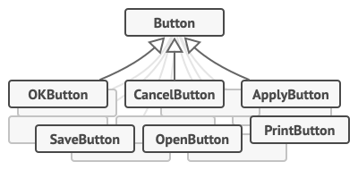

# Command

##### Also known as: Action, Transaction

## 🦧 Intent

**Command** is a behavioral design pattern that turns a request into a stand-alone object that contains all information
about the request. This transformation lets you pass requests as a method arguments, delay or queue a request’s
execution, and support undoable operations.

## 🙁 Problem

Imagine that you’re working on a new text editor app. Your current task is to create a toolbar with a bunch of buttons
for various operations of the editor. You created a very neat `Button` class that can be used for buttons on the
toolbar, and also for generic buttons in various dialogs.


<center><i>All buttons of the app are derived from the same class.</i></center>

While all of these buttons look similar, they’re all supposed to do different things. Where would you put the code for
the various click handlers of these buttons? The simplest solution is to create a ton of subclasses for each place where
the button is used. These subclasses would contain the code that would have to be executed on a button click.


<center><i>Many subclasses are required to handle different button clicks.</i></center>

Before long, you realize that this approach is deeply flawed. First, you have an enormous number of subclasses, and that
would be okay if you weren’t risking breaking the code in these subclasses each time you modify the base `Button` class.
Put simply, your GUI code has become awkwardly dependent on the volatile code of the business logic.


<center><i>Several classes implement the same functionality.</i></center>

And here’s the ugliest part. Some operations, such as copying/pasting text, would need to be invoked from multiple
places. For example, a user could click a small “Copy” button on the toolbar, or copy something via the context menu, or
just hit `Ctrl+C` on the keyboard.

Initially, when our app only had the toolbar, it was okay to place the implementation of various operations into the
button subclasses. In other words, having the code for copying text inside the `CopyButton` subclass was fine. But then,
when you implement context menus, shortcuts, and other stuff, you have to either duplicate the operation’s code in many
classes or make menus dependent on buttons, which is an even worse option.

## 😀 Solution

Good software design is often based on the principle of *separation of concerns*, which usually results in breaking an
app
into layers. The most common example: a layer for the graphical user interface and another layer for the business logic.
The GUI layer is responsible for rendering a beautiful picture on the screen, capturing any input and showing results of
what the user and the app are doing. However, when it comes to doing something important, like calculating the
trajectory of the moon or composing an annual report, the GUI layer delegates the work to the underlying layer of
business logic.

In the code it might look like this: a GUI object calls a method of a business logic object, passing it some arguments.
This process is usually described as one object sending another a *request*.


<center><i>The GUI objects may access the business logic objects directly.</i></center>

The Command pattern suggests that GUI objects shouldn’t send these requests directly. Instead, you should extract all of
the request details, such as the object being called, the name of the method and the list of arguments into a separate
command class with a single method that triggers this request.

Command objects serve as links between various GUI and business logic objects. From now on, the GUI object doesn’t need
to know what business logic object will receive the request and how it’ll be processed. The GUI object just triggers the
command, which handles all the details.


<center><i>Accessing the business logic layer via a command.</i></center>

The next step is to make your commands implement the same interface. Usually it has just a single execution method that
takes no parameters. This interface lets you use various commands with the same request sender, without coupling it to
concrete classes of commands. As a bonus, now you can switch command objects linked to the sender, effectively changing
the sender’s behavior at runtime.

You might have noticed one missing piece of the puzzle, which is the request parameters. A GUI object might have
supplied the business-layer object with some parameters. Since the command execution method doesn’t have any parameters,
how would we pass the request details to the receiver? It turns out the command should be either pre-configured with
this data, or capable of getting it on its own.


<center><i>The GUI objects delegate the request to the command.</i></center>

Let’s get back to our text editor. After we apply the Command pattern, we no longer need all those button subclasses to
implement various click behaviors. It’s enough to put a single field into the base Button class that stores a reference
to a command object and make the button execute that command on a click.

You’ll implement a bunch of command classes for every possible operation and link them with particular buttons,
depending on the buttons’ intended behavior.

Other GUI elements, such as menus, shortcuts or entire dialogs, can be implemented in the same way. They’ll be linked to
a command which gets executed when a user interacts with the GUI element. As you’ve probably guessed by now, the
elements related to the same operations will be linked to the same commands, preventing any code duplication.

As a result, commands become a convenient middle layer that reduces coupling between the GUI and business logic layers.
And that’s only a fraction of the benefits that the Command pattern can offer!

## Structure


<ol>
<li>The <b>Sender</b> class (aka <i>invoker</i>) is responsible for initiating requests. This class must have a field for storing a
   reference to a command object. The sender triggers that command instead of sending the request directly to the
   receiver. Note that the sender isn’t responsible for creating the command object. Usually, it gets a pre-created
   command from the client via the constructor. </li>
<li>The <b>Command</b> interface usually declares just a single method for executing the command. </li>
<li>
<b>Concrete Commands</b> implement various kinds of requests. A concrete command isn’t supposed to perform the work on its
   own, but rather to pass the call to one of the business logic objects. However, for the sake of simplifying the code,
   these classes can be merged.

Parameters required to execute a method on a receiving object can be declared as fields in the concrete command. You can
make command objects immutable by only allowing the initialization of these fields via the constructor.
</li>
<li>
The <b>Receiver</b> class contains some business logic. Almost any object may act as a receiver. Most commands only handle the details of how a request is passed to the receiver, while the receiver itself does the actual work.
</li>
<li>
The <b>Client</b> creates and configures concrete command objects. The client must pass all of the request parameters, including a receiver instance, into the command’s constructor. After that, the resulting command may be associated with one or multiple senders.
</li>
</ol>

## Pseudocode

This example shows how the Command pattern can be used to implement a simple text editor with a history of operations
that can be undone.


<center><i>Undoable operations in a text editor.</i></center>

Commands which result in changing the state of the editor (e.g., cutting and pasting) make a backup copy of the editor’s
state before executing an operation associated with the command. After a command is executed, it’s placed into the
command history (a stack of command objects) along with the backup copy of the editor’s state at that point. Later, if
the user needs to revert an operation, the app can take the most recent command from the history, read the associated
backup of the editor’s state, and restore it.

The client code (GUI elements, command history, etc.) isn’t coupled to concrete command classes because it works with
commands via the command interface. This approach lets you introduce new commands into the app without breaking any
existing code.

```
// The base command class defines the common interface for all
// concrete commands.
abstract class Command is
    protected field app: Application
    protected field editor: editor
    protected field backup: text

    constructor Command(app: Application, editor: editor) is
        this.app = app
        this.editor = editor

    // Make a backup of the editor's state.
    method saveBackup() is
        backup = editor.text

    // Restore the editor's state.
    method undo() is
        editor.text = backup

    // The execution method is declared abstract to force all
    // concrete commands to provide their own implementations.
    // The method must return true or false depending on whether
    // the command changes the editor's state.
    abstract method execute()


// The concrete commands go here.
class CopyCommand extends Command is
    // The copy command isn't saved to the history since it
    // doesn't change the editor's state.
    method execute() is
        app.clipboard = editor.getSelection()
        return false

class CutCommand extends Command is
    // The cut command does change the editor's state, therefore
    // it must be saved to the history. And it'll be saved as
    // long as the method returns true.
    method execute() is
        saveBackup()
        app.clipboard = editor.getSelection()
        editor.deleteSelection()
        return true

class PasteCommand extends Command is
    method execute() is
        saveBackup()
        editor.replaceSelection(app.clipboard)
        return true

// The undo operation is also a command.
class UndoCommand extends Command is
    method execute() is
        app.undo()
        return false


// The global command history is just a stack.
class CommandHistory is
    private field history: array of Command

    // Last in...
    method push(c: Command) is
        // Push the command to the end of the history array.

    // ...first out
    method pop():Command is
        // Get the most recent command from the history.


// The editor class has actual text editing operations. It plays
// the role of a receiver: all commands end up delegating
// execution to the editor's methods.
class editor is
    field text: string

    method getSelection() is
        // Return selected text.

    method deleteSelection() is
        // Delete selected text.

    method replaceSelection(text) is
        // Insert the clipboard's contents at the current
        // position.


// The application class sets up object relations. It acts as a
// sender: when something needs to be done, it creates a command
// object and executes it.
class Application is
    field clipboard: string
    field editors: array of Editors
    field activeEditor: editor
    field history: CommandHistory

    // The code which assigns commands to UI objects may look
    // like this.
    method createUI() is
        // ...
        copy = function() { executeCommand(
            new CopyCommand(this, activeEditor)) }
        copyButton.setCommand(copy)
        shortcuts.onKeyPress("Ctrl+C", copy)

        cut = function() { executeCommand(
            new CutCommand(this, activeEditor)) }
        cutButton.setCommand(cut)
        shortcuts.onKeyPress("Ctrl+X", cut)

        paste = function() { executeCommand(
            new PasteCommand(this, activeEditor)) }
        pasteButton.setCommand(paste)
        shortcuts.onKeyPress("Ctrl+V", paste)

        undo = function() { executeCommand(
            new UndoCommand(this, activeEditor)) }
        undoButton.setCommand(undo)
        shortcuts.onKeyPress("Ctrl+Z", undo)

    // Execute a command and check whether it has to be added to
    // the history.
    method executeCommand(command) is
        if (command.execute())
            history.push(command)

    // Take the most recent command from the history and run its
    // undo method. Note that we don't know the class of that
    // command. But we don't have to, since the command knows
    // how to undo its own action.
    method undo() is
        command = history.pop()
        if (command != null)
            command.undo()
```

## ✨ Application

**⚠️ Use the Command pattern when you want to parameterize objects with operations.**

**🗲** The Command pattern can turn a specific method call into a stand-alone object. This change opens up a lot of
interesting uses: you can pass commands as method arguments, store them inside other objects, switch linked commands at
runtime, etc.

Here’s an example: you’re developing a GUI component such as a context menu, and you want your users to be able to
configure menu items that trigger operations when an end user clicks an item.

**⚠️ Use the Command pattern when you want to queue operations, schedule their execution, or execute them remotely.**

**🗲** As with any other object, a command can be serialized, which means it can be easily written to a file or a
database, and then restored to be executed later.

**⚠️ Use the Command pattern when you want to implement reversible operations.**

**🗲**  Although there are many ways to implement undo/redo, the Command pattern is perhaps the most popular of all.

To be able to revert operations, you need to implement the history of performed operations. The command history is a
stack that contains all executed command objects along with related backups of the application’s state.

This method has two drawbacks. First, it isn’t that easy to save an application’s state because some of it can be
private. This problem can be mitigated with the Memento pattern.

Second, the state backups may consume quite a lot of RAM. Therefore, sometimes you can resort to an alternative
implementation: instead of restoring the past state, the command performs the inverse operation. The reverse operation
also has a price: it may turn out to be hard or even impossible to implement.

## 📋 How to Implement

1. Declare the command interface with a single execution method.
2. Start extracting requests into concrete command classes that implement the command interface. Each class must have a
   set of fields for storing the request arguments along with a reference to the receiver object.
3. Identify classes that will act as invokers. Add the fields for storing commands to these classes. Invokers should
   only communicate with commands via the command interface.
4. The client is responsible for creating the command objects and the receiver objects. The client must then associate
   the command with the receiver and pass it to the invoker.

## ⚖️ Pros and Cons

| ✅ **Pros**                                                                                                                     | ❌ **Cons**                                                                                                     |
|--------------------------------------------------------------------------------------------------------------------------------|----------------------------------------------------------------------------------------------------------------|
| *Single Responsibility Principle*. You can decouple classes that invoke operations from classes that perform these operations. | The code may become more complicated since you’re introducing a whole new layer between senders and receivers. |
| *Open/Closed Principle*. You can introduce new commands into the app without breaking existing client code.                    |                                                                                                                |
| You can implement undo/redo.                                                                                                   |                                                                                                                |
| You can implement deferred execution of operations.                                                                            |                                                                                                                |
| You can assemble a set of simple commands into a complex one.                                                                  |                                                                                                                |

## ↔️ Relations with Other Patterns

- **Chain of Responsibility**, **Command**, **Mediator** and **Observer** address various ways of connecting senders and
  receivers of requests:
    - *Chain of Responsibility* passes a request sequentially along a dynamic chain of potential receivers until one of
      them handles it.
    - *Command* establishes unidirectional connections between senders and receivers.
    - *Mediator* eliminates direct connections between senders and receivers, forcing them to communicate indirectly via
      a mediator object.
    - *Observer* lets receivers dynamically subscribe to and unsubscribe from receiving requests.
- **Command** and **Strategy** may look similar because you can use both to parameterize an object with some action.
  However, they are quite different.
    - You can use *Command* to turn any operation into an object. The operation’s parameters, the object that the
      operation is performed on, and the operation itself are all encapsulated in the command object.
    - *Strategy*, on the other hand, is a more specific pattern. It’s about providing different ways to do something.
- **Prototype** can help when you need to copy commands.
- You can use **Visitor** to execute an operation over a whole command history.
- You can use **Memento** to save the state of the application before executing an operation. The command history can
  then be used to restore the application to a previous state.
